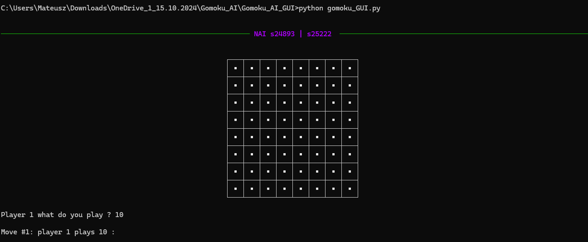
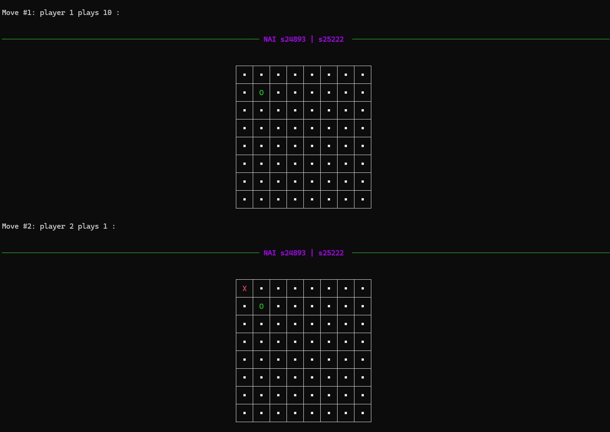
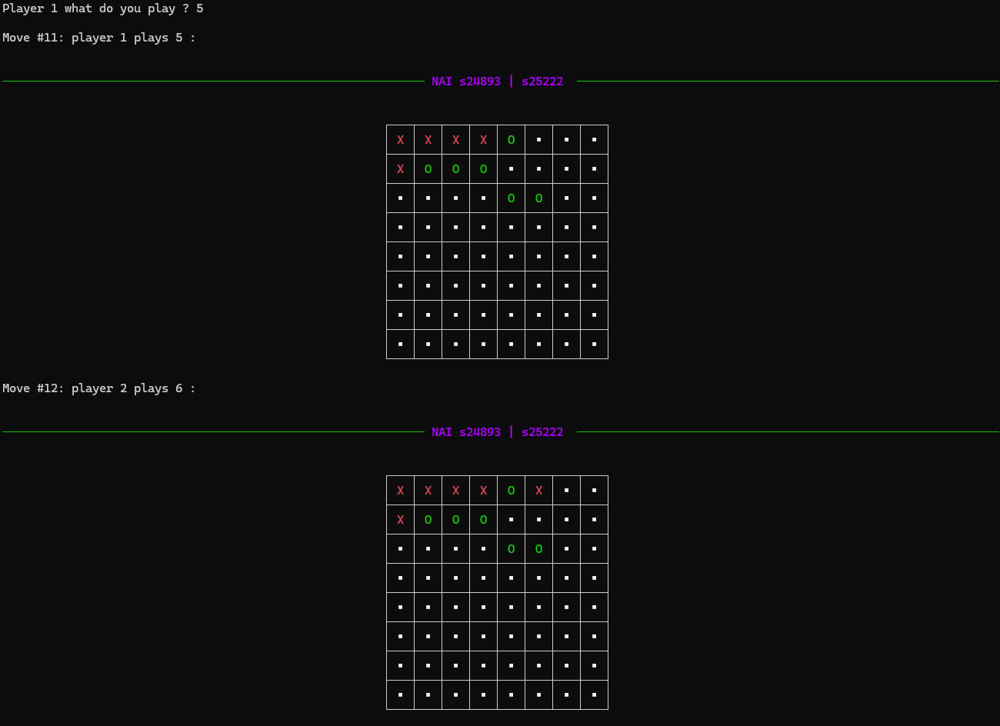
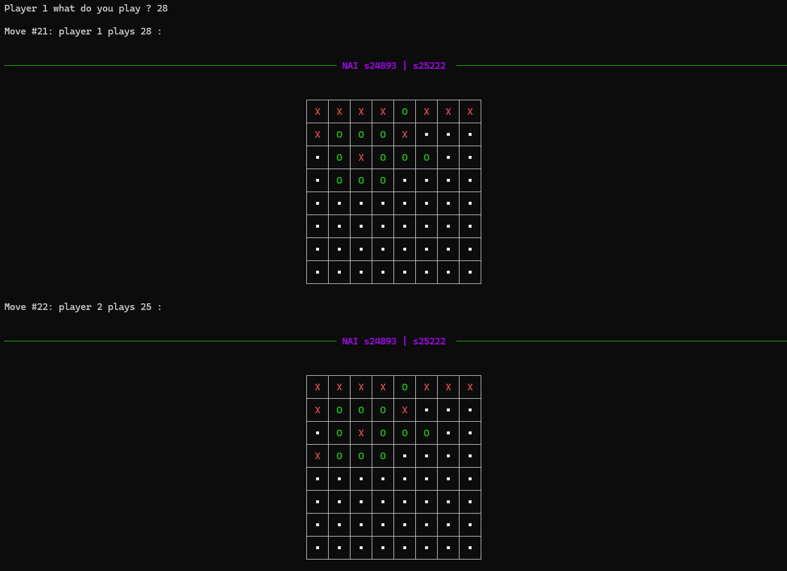
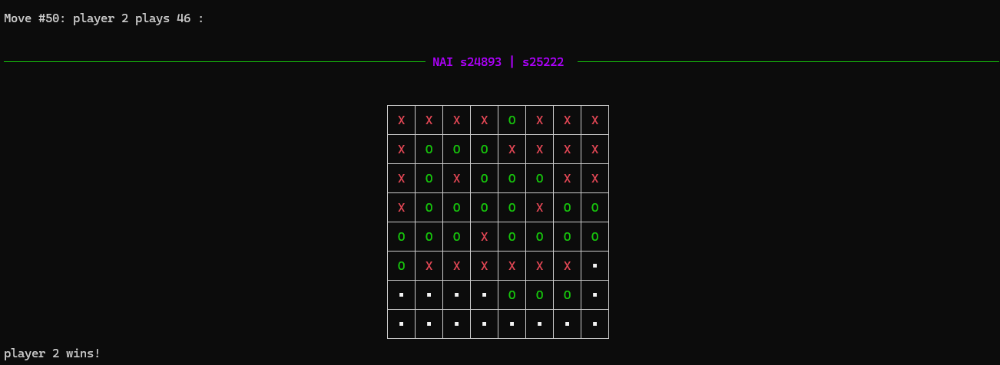

# Gomoku

Gra Gomoku, rozgrywana na planszy 8x8, w której dwóch graczy rywalizuje, starając się umieścić pięć swoich znaków w jednej linii (poziomo, pionowo lub ukośnie). Gra jest obsługiwana z poziomu wiersza poleceń (CMD) i została zaimplementowana w Pythonie z wykorzystaniem bibliotek `easyAI` i `rich`.

## Autorzy

- Andrzej Ebertowski s25222
- Mateusz Wiśniewski s24893

## Opis

Gomoku to klasyczna gra planszowa, w której celem jest ułożenie pięciu znaków w linii. Gra wykorzystuje bibliotekę `easyAI` do implementacji sztucznej inteligencji i algorytmu Negamax, a także bibliotekę `rich` do wyświetlania planszy w formie estetycznej tabeli w terminalu.

## Wymagania

- Python 3.x
- Biblioteka `easyAI`
- Biblioteka `rich`

### Instalacja wymaganych bibliotek

Aby zainstalować niezbędne biblioteki, uruchom poniższe polecenia w terminalu:

```bash
pip install easyai
pip install rich
```

## Zasady gry

- Gra toczy się na planszy 8x8.
- Gracze wykonują ruchy naprzemiennie, wybierając numer pola (od 1 do 64).
- Celem gry jest ułożenie pięciu znaków (X lub O) w jednej linii (poziomej, pionowej lub ukośnej).
- Gra kończy się, gdy któryś z graczy spełni warunek zwycięstwa lub zostan

## Instrukcja uruchomienia
Aby uruchomić grę, otwórz terminal (CMD) i wykonaj poniższe polecenie:
```bash
python gomoku_GUI.py
```

## Zrzuty ekranu

Poniżej znajdują się zrzuty ekranu z rozgrywki:

### Zrzut ekranu 1


### Zrzut ekranu 2


### Zrzut ekranu 3


### Zrzut ekranu 4


### Zrzut ekranu 5


