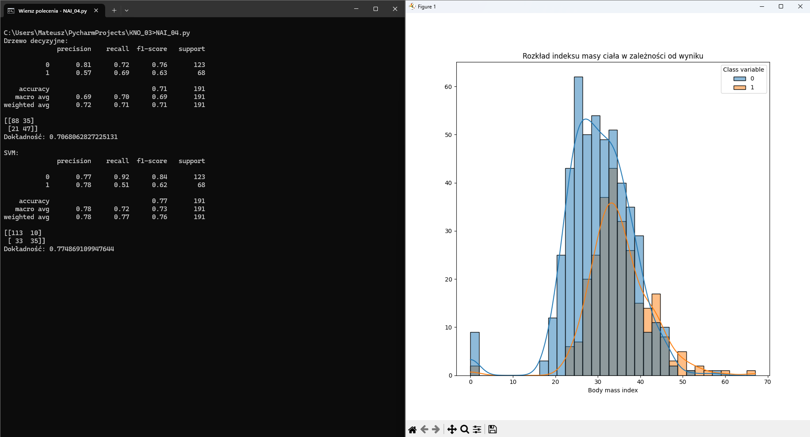
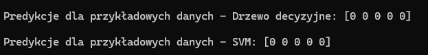
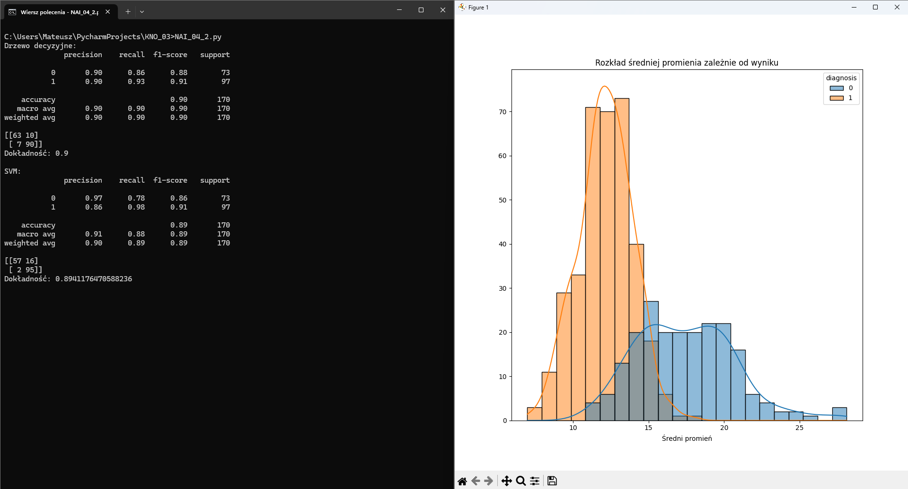
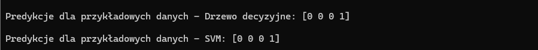

# Klasyfikacja danych

Pierwszy program realizuje klasyfikacje danych za pomocą drzewa decyzyjnego oraz SVM na podstawie zbioru danych Pima Indian Diabetes
[https://raw.githubusercontent.com/jbrownlee/Datasets/master/pima-indians-diabetes.csv]
i dokonuje przewidywania czy dana osoba ma predyspocycje do bycia diabetykiem na podstawie danych wejściowych.

Drugi program realizuje klasyfikacje danych za pomocą drzewa decyzyjnego oraz SVM na podstawie zbioru danych Breast Cancer Wisconsin (Diagnostic)
[https://www.kaggle.com/datasets/uciml/breast-cancer-wisconsin-data]
i dokonuje przewidywania czy nowotwór piersi występuje w formie łagodnej czy złośliwej
Zostały zmieniowe wartości nowotworów na wartości numeryczne (M - 0) (B - 1)

## Autorzy

- Andrzej Ebertowski s25222
- Mateusz Wiśniewski s24893

## Wymagania

- Python 3.x
- Biblioteka `pandas`
- Biblioteka `scikit-learn`
- Biblioteka `numpy`
- Biblioteka `seaborn`
- Biblioteka `matplotlib`

### Instalacja wymaganych bibliotek

Aby zainstalować niezbędne biblioteki, uruchom poniższe polecenia w terminalu:

```bash
pip install numpy
pip install pandas
pip install scikit-learn
pip install seaborn
pip install matplotlib
```

## Instrukcja uruchomienia
Aby uruchomić program, otwórz terminal (CMD) i wykonaj poniższe polecenie:
```bash
NAI_04.py
```

```bash
NAI_04_2.py
```

## Zrzuty ekranu
### Dane wejściowe wraz z poprawnym wynikiem znajdują się w pliku [Dane z poprawnymi wynikami](dane_do_predykcji.txt)

Poniżej znajdują się zrzuty ekranu z działania programu:







