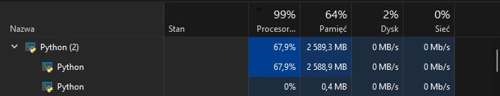
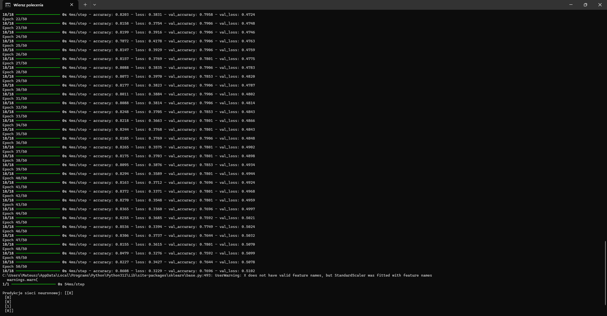
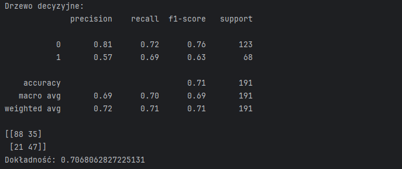
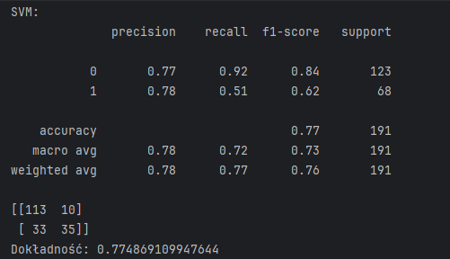
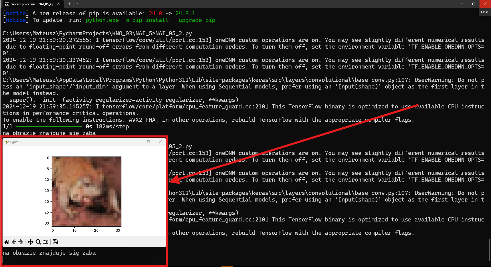
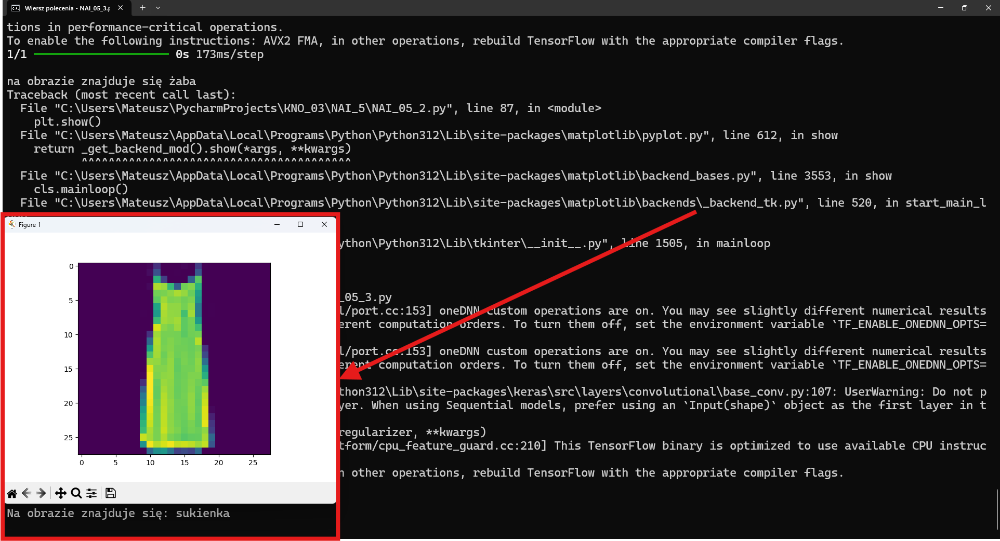
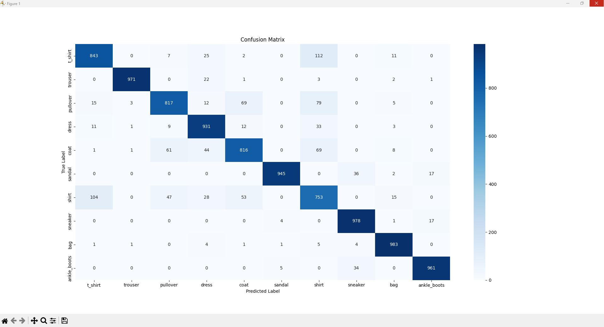

# Sieci Neuronowe

Pierwszy program realizuje klasyfikacje danych za pomocą sieci neuronowej na podstawie zbioru danych Pima Indian Diabetes
[https://raw.githubusercontent.com/jbrownlee/Datasets/master/pima-indians-diabetes.csv]
i dokonuje przewidywania czy dana osoba ma predyspocycje do bycia diabetykiem na podstawie danych wejściowych.

Drugi program program realizuje klasyfikację obrazów ze zbioru danych CIFAR-10, który zawiera obrazy z 10 różnymi klasami (samolot, samochód, ptak, kot, jeleń, pies, żaba, koń, statek, ciężarówka). Program wykorzystuje konwolucyjną sieć neuronową (CNN) do rozpoznawania i klasyfikowania tych obrazów.
[https://www.cs.toronto.edu/~kriz/cifar.html]

Trzeci program realizuje klasyfikację obrazów ubrań ze zbioru danych Fashion-MNIST. Wykorzystuje konwolucyjną sieć neuronową (CNN) do rozpoznawania i kategoryzowania 10 różnych typów odzieży (koszulka, spodnie, pulower, sukienka, płaszcz, sandał, koszula, trampki, torba, botki)
[https://keras.io/api/datasets/fashion_mnist/]

Programy również korzystają z biblioteki deep_translator do automatycznego tłumaczenie przewidywań

Programy 2 oraz 3 zapisują oraz wczytują modele sieci neuronowej z powodu długiego czasu kompilacji i wysokiego obciążenia procesora


## Autorzy

- Andrzej Ebertowski s25222
- Mateusz Wiśniewski s24893

## Wymagania

- Python 3.x
- Biblioteka `pandas`
- Biblioteka `scikit-learn`
- Biblioteka `numpy`
- Biblioteka `seaborn`
- Biblioteka `matplotlib`
- Biblioteka `deep_translator`
- Biblioteka `tensorflow`

### Instalacja wymaganych bibliotek

Aby zainstalować niezbędne biblioteki, uruchom poniższe polecenia w terminalu:

```bash
pip install numpy
pip install pandas
pip install scikit-learn
pip install seaborn
pip install matplotlib
pip install tensorflow
pip install deep_translator
```

## Instrukcja uruchomienia
Aby uruchomić program, otwórz terminal (CMD) i wykonaj poniższe polecenie:
```bash
NAI_05_1.py
```

```bash
NAI_05_2.py
```

```bash
NAI_05_2_Porównanie_sieci.py
```

```bash
NAI_05_3.py
```

## Zrzuty ekranu
### Dane wejściowe wraz z poprawnym wynikiem do zadania 1 znajdują się w pliku [Dane z poprawnymi wynikami](dane_do_predykcji.txt)

Poniżej znajdują się zrzuty ekranu z działania programów:

### Zadanie 1


#### Dokładność sieci neuronowej na zbiorze testowym i walidacyjnym: 0.8608, 0.7696

#### Dokładność drzewa decyzyjnego

#### Dokładność SVM 

### Zadanie 2


#### efekt predykcji sieci neuronowej dla zbioru CIFAR-10

#### Porównanie dwóch sieci neurnowych o różnej wielkości

### Zadanie 3


#### efekt predykcji sieci neuronowej dla zbioru Fashion MNIST

#### Confusion Matrix dla zbioru Fashion MNIST
